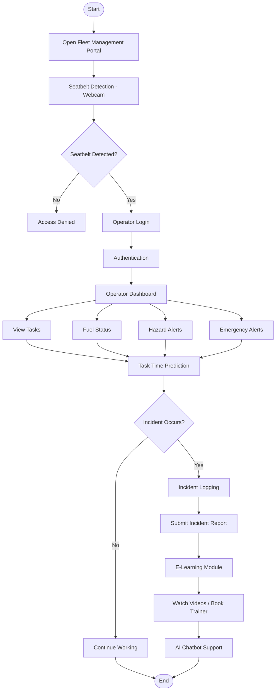

OVERVIEW:
The Fleet Management Portal is a Minimum Viable Product (MVP) developed to improve the safety, efficiency, and productivity of fleet operators. The portal serves as a centralized platform where operators can complete mandatory safety checks before operating machinery, access operational information, report incidents, learn machine usage procedures, and receive instant assistance through an AI-powered chatbot.

OBJECTIVE:
The primary objectives of the Fleet Management Portal are:
Improve operator safety by ensuring seatbelt verification before login.
Digitize incident reporting to reduce paperwork and improve record management.
Provide operators with easy access to training resources and operational guidance.
Assist operators using an AI chatbot for instant clarification of machine-related queries.
Display task assignments, fuel consumption, hazards, and operational alerts through a centralized dashboard.

KEY FEATURES:
1. Driver Seatbelt Detection
Webcam-based safety verification before operator login.
Simulated seatbelt detection using Streamlit WebRTC.
Prevents system access until safety verification is completed.
Supports multiple login methods:
Operator ID
Fingerprint (Simulated)
Barcode Scan (Simulated)

2. Operator Dashboard
Provides real-time operational information including:
Fuel consumption
Assigned tasks
Hazard alerts
Emergency notifications
Task completion time estimation,Task summary.

3. Incident Logging System
Allows operators to report incidents digitally.
Features include:
Incident type selection
Date and time recording
Location entry
Detailed description
Image upload for evidence
One-click incident submission

4. E-Learning Module
Helps operators understand machine usage and safety procedures.
Includes:
Embedded training videos
Instructor booking system
Training request form

5. AI Chatbot 
Provides instant responses to operator queries.
Can answer questions related to:
Machine operation
Safety procedures
Troubleshooting
Maintenance guidelines

6. Task Completion Time Prediction
Predicts estimated completion time using:
Load capacity
Available fuel
Weather conditions

METHODOLOGY:
The Fleet Management Portal was developed using a modular approach, where each module addresses a specific aspect of fleet operations while ensuring a seamless user experience. The workflow begins with a driver safety verification, where the operator performs a webcam-based seatbelt check before gaining access to the system. Once the safety check is successfully completed, the operator authenticates using one of the available login methods, such as Operator ID, simulated fingerprint, or barcode authentication. After successful authentication, the operator is redirected to the dashboard, which provides an overview of fuel consumption, assigned tasks, hazard notifications, emergency alerts, and task summaries. The dashboard also includes a simple task completion time prediction feature that estimates the completion time based on factors such as load capacity, available fuel, and weather conditions.In case of an accident or operational issue, the operator can navigate to the Incident Logging module to digitally report the incident by providing details such as the incident type, location, date, time, description, and supporting images.
To improve operator knowledge and reduce operational errors, the portal also includes an E-Learning module that provides instructional videos and allows operators to book training sessions with instructors. Additionally, an AI Chatbot module is incorporated as a support system to answer operator queries related to machine operation, safety procedures, and troubleshooting. Although currently implemented as a placeholder, the chatbot is designed for future integration with an AI language model.

WORKFLOW:

